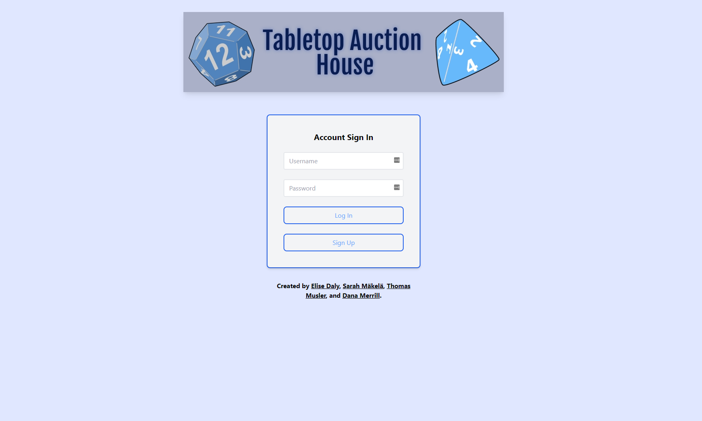
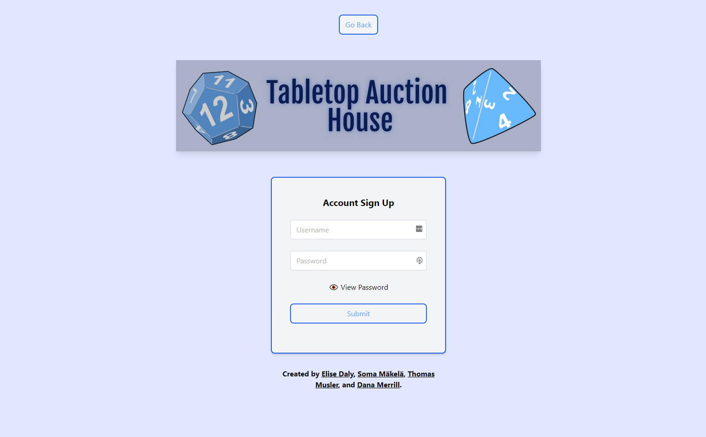
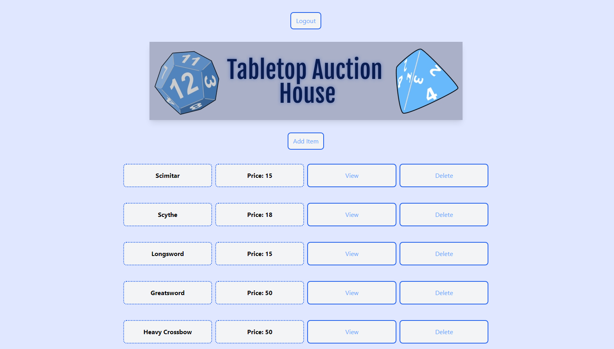
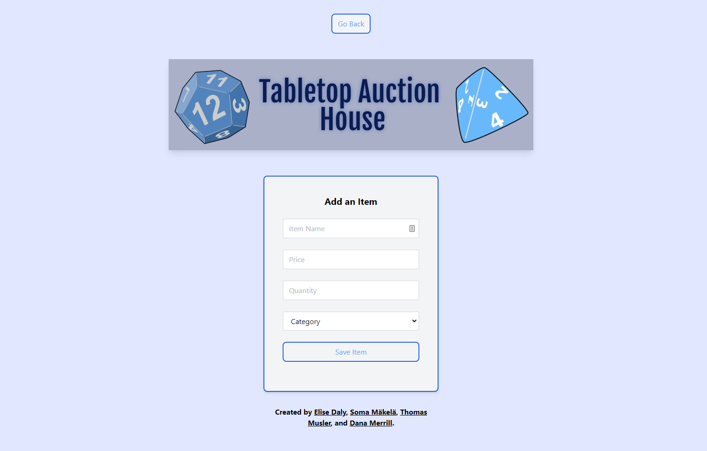
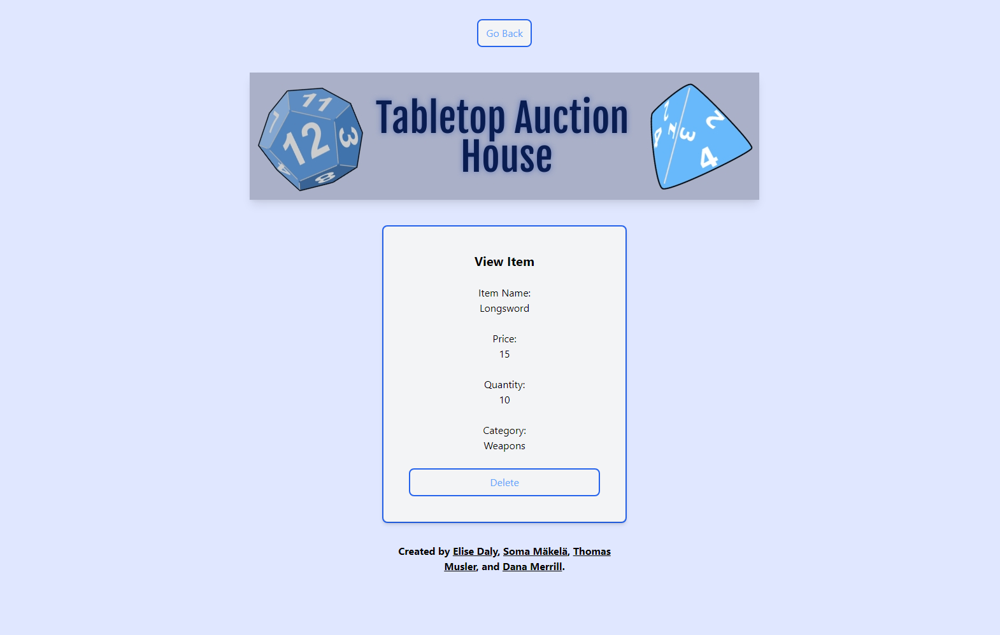

# Tabletop_Auction_House


## Description

*Our goal is to create an auction house interface for roleplaying game masters and players to buy, sell, and trade in-game items for fun and profit.*

Tabletop Auction House provides a marketplace for gamers and game masters to create and exchange in-game equipment, both reducing the creative pressure on the gm and establishing a unique channel by which games might grow and evolve.

Sometimes you don’t want to have to think about the ‘simple’ things when it comes to world-building. Our marketplace takes some of that pressure off while also creating a way to advance the story to whatever depth is desired by the team.

As a game master, you can:

* Display ordinary items for players to purchase
* Introduce items that affect the narrative and move the party in new ways through their environment

As a gamer, you can:

* See gear standards for your game
* Grab cool items for your character

Visit the Tabletop Auction House today for your roleplaying marketplace needs.

Tabletop Auction House uses JavaScript, Handlebars, MySQL/JawsDB, Heroku, Tailwind CSS, Book Brush, and a Favicon Generator. More technologies that we would like to add in the future include Cloudinary and RPG-Awesome.

## Table of Contents

* [Description](#description)
* [Installation](#installation)
* [Usage](#usage)
* [Wireframe](#wireframe)
* [Credits](#credits)
* [License](#license)

## Installation

To install the application's dependencies, type the following:
```md
npm install
```
To build Tailwind CSS, type the following:
```md
npm run tw:build
```
To run the server after you've added the schema.sql to your MySQL Workbench, type the following:
```md
npm start
```
Once those steps are done, you can view the application in your browser using localhost:3001.

## Usage



A user can use the sign-up page to create their account. They will be directed to the shop page afterward.



The shop page displays all of the products. The user can click on the Add Item page, View, and Delete buttons, or they can choose to log out.



The user can add an item by entering the Item Name, Price, Quantity, and Category and clicking Save Item.



The user can also view an item and see the Item Name, Price, Quantity, and Category. They can delete the item on this page, if they wish.



Navigate to [Tabletop Auction House](https://tabletop-auction-house.herokuapp.com/) and view the web page.

## Wireframe

A wireframe showing the page's design.

[Tabletop Auction House's Wireframe](https://docs.google.com/presentation/d/1ZrrW8pyQqQYYu9Z_OkplCIA2Lk5IExDmOEinp_IujaI/)

## Credits

Tabletop Auction House is a coding project done by the Friendly Merchants. The team members are:
* Elise Daly - [https://github.com/elisesamanthadaly/](https://github.com/elisesamanthadaly/)
* Sarah Mäkelä - [https://github.com/smakela13/](https://github.com/smakela13/)
* Thomas Musler - [https://github.com/lordgeer/](https://github.com/lordgeer/)
* Dana Merrill - [https://github.com/dtmerrill/](https://github.com/dtmerrill/)

## License

This application is licensed under MIT License. Click the badge for more information on how you can use this project.


