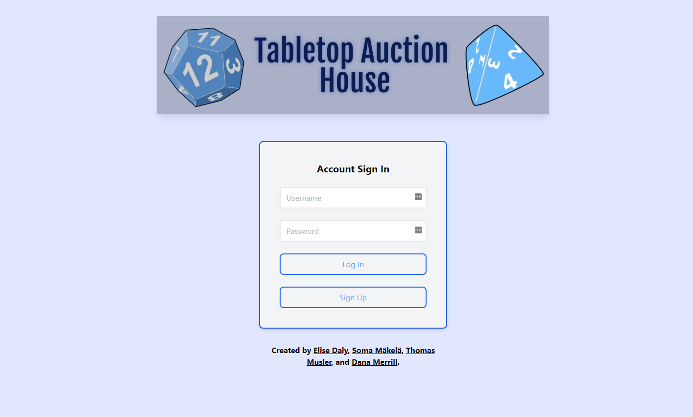

# Tabletop_Auction_House

## Description

Our goal is to create an auction interface for role-playing gamers to buy/sell/trade in-game items for fun and profit.

INSERT MORE DESCRIPTION HERE

Tabletop Auction House uses JavaScript, Handlebars, MySQL/JawsDB, Heroku, Tailwind CSS, Book Brush, and a Favicon Generator. More technologies that we would like to add in the future include Cloudinary and RPG-Awesome.

## Table of Contents

* [Description](#description)
* [Usage](#usage)
* [Wireframe](#wireframe)
* [Credits](#credits)
* [License](#license)

## Usage

The log-in page is the first page of the website a user will see when they visit.

A user can use the sign-up page to create their account. They will be directed to the shop page afterward.

The shop page displays all of the products. The user can click on the Add Item page, View, and Delete buttons, or they can choose to log out.

The user can add an item by entering the Item Name, Price, Quantity, and Category and clicking Save Item.

The user can also view an item and see the Item Name, Price, Quantity, and Category. They can delete the item on this page, if they wish.

Navigate to [Tabletop Auction House](https://tabletop-auction-house.herokuapp.com/) and view the web page.

## Wireframe

A wireframe showing the page's design.

[Tabletop Auction House's Wireframe](https://docs.google.com/presentation/d/1ZrrW8pyQqQYYu9Z_OkplCIA2Lk5IExDmOEinp_IujaI/)

## Credits

Tabletop Auction House is a coding project done by the Friendly Merchants. The team members are:
* Elise Daly - [https://github.com/elisesamanthadaly/](https://github.com/elisesamanthadaly/)
* Sarah Mäkelä - [https://github.com/smakela13/](https://github.com/smakela13/)
* Thomas Musler - [https://github.com/lordgeer/](https://github.com/lordgeer/)
* Dana Merrill - [https://github.com/dtmerrill/](https://github.com/dtmerrill/)

## License

This application is licensed under MIT License. Click the badge for more information on how you can use this project.

